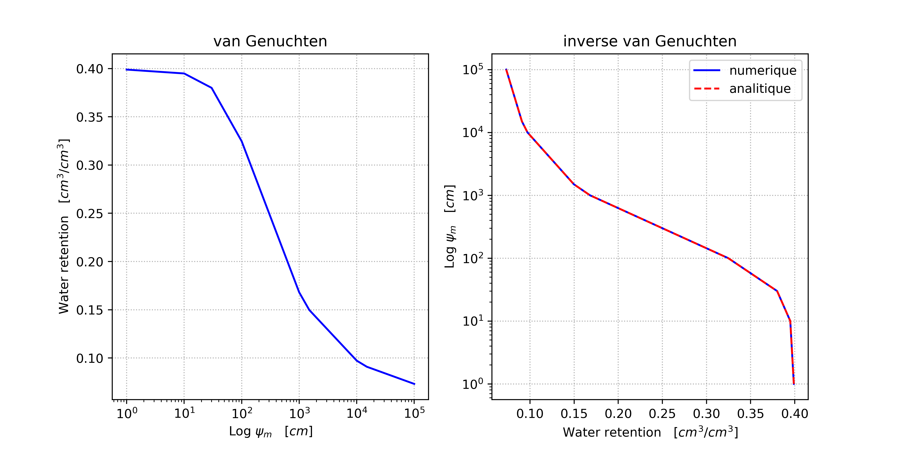

# vanGenuchten.py - Lien entre le stock d'eau et MARSHAL

### Ce script python permet de mettre à jour le stock d'eau utilisé dans MARSHAL en utilsant une courbe de rétention d'eau

#### Auteur : Mattias Van Eetvelt, Basile Delvoie


## 1. Principe 
MARSHAL prend comme input un fichier `soil.csv` qui décrit le potentiel matriciel du sol. Pour un certain type de sol et un certain potentiel matriciel on peut déterminer une valeur de $\theta$, le contenu en eau du sol via une courbe de rétention d'eau. En particulier, on considère ici le modèle de van Genuchten pour un sol limoneux. En faisant la moyenne des valeurs $\theta_{sup}$ et $\theta_{inf}$ on peut calculer le stock d'eau contenu dans un profil de sol et donc calculer le stock d'eau initial dans MARSHAL. 

Après le premier run de MARSHAL, il suffit de soustraire la valeur de transpiration calculée afin de déterminer le stock d'eau restant. Il suffit alors de faire le chemin inverse pour pouvoir calculer les valeurs de $\theta$ correspondante et mettre à jour les valeurs du potentiel matriciel $\Psi_m$ dans le fichier `soil.csv`.

### 1.1 Description des équations
On fait comme hypothèse que $\theta_{z=0}$ est constant et fixé à -15 000 hPa et que le contenu en eau évolue linéairement entre $z=0$ et $z=-40$, permettant de calculer une moyenne pour $\theta$. 

$$
\begin{split}
\sum S_i &= S_1 + S_2 +S_3 \quad \text{avec} \quad S_1 = \frac{\theta_1+\theta_2}{2}40 \quad \text{et} \quad S_2 = S_3 \\
&= S_1 + 2S_2 \\
&= \frac{\theta_1+\theta_2}{2}40 + 2(\theta_2 40) \\
\end{split}
$$

Où $\sum S_i$ [cm] est le stock d'eau total du sol et 40 [cm] est la profondeur d'un profil. Il suffit alors de résoudre pour $\theta$ pour déterminer les nouvelles valeurs à metter dans `soil.csv`.

## 2. Modèle de van Genuchten
Le modèle prend 4 paramètres : 
- $\theta_s = 0.3991 [cm^3/cm^3]$ 
- $\theta_r = 0.0609 [cm^3/cm^3]$ 
- $\alpha = 0.0111   [cm^{-1}]$ 
- $n = 1.4737        [-]$ 

Le modèle permet de calculer un potentiel matriciel, $\Psi_m$, exprimé en cm.

## 3. Documentation code
Le code est assez bien commenté donc n'hésitez pas à aller voir le code directement. Il implémente le modèle de van Genuchten et deux fonction inverse, une sur base de l'équation analytique et l'autre via un calcul numérique. 

Le code utilise la librairie `pynverse` afin de calculer la fonction inverse de van Genuchten. Il faut donc bien s'assurer de l'avoir dans l'environnement utilisé. Si ce n'est pas le cas alors il suffit de faire : 

```
pip install pynverse
```
Il faut bien faire attention aux unités utilisées lorsque on rentre des valeurs dans les fonctions. A priori, les valeurs seront toujours en hPa. Il faut donc spécifier l'argument `unit='hPa'`. 

## Remarques
Merci à Basile de m'avoir aider pour la partie théorique et aussi pour m'avoir fourni le valeurs des paramètres du modèle de van Genuchten. Ces valeurs viennent de HYDRUS pour un sol limoneux (loam). 

